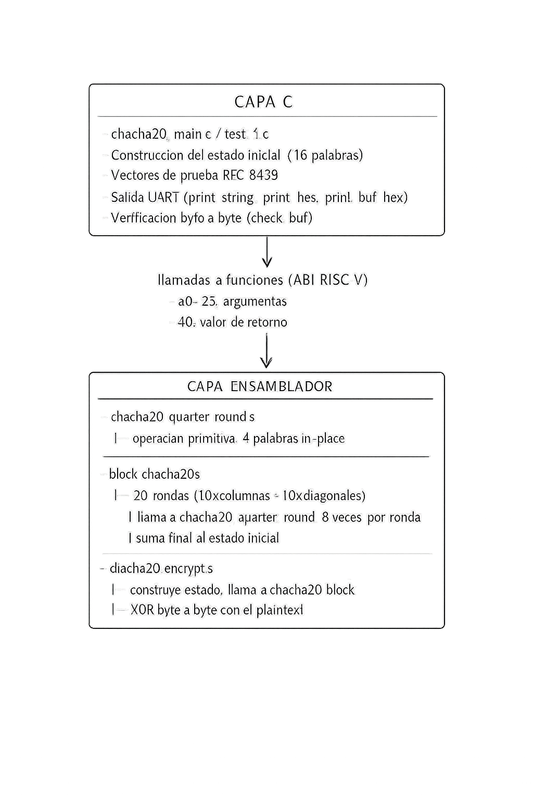

# Documentación Proyecto Individual - Arquitectura de Computadores I - Implementación de algoritmo ChaCha20 en Ensamblador RISC-V


Implementación del algoritmo de cifrado de flujo ChaCha20 (RFC 8439) en ensamblador RISC-V de 32 bits, ejecutado sobre QEMU con depuración GDB.

---

## 1. Descripción de la Arquitectura del Software

### 1.1 Separación entre capas C y ensamblador

La implementación sigue una arquitectura de dos capas bien definidas, la capa de C que sirve para el programa principal en main, las pruebas unitarias y la de ensamblador que contiene las 3 funciones principales.

Para la capa de C es transparente el manejo interno sobre registros o el stack de las funciones de ensamblador. Los archivos `chacha20_quarter_round.s`, `block_chacha20.s` y `chacha20_encrypt.s` son donde se implementó cada función en RISCV. Para que la capa en C pueda hacer las llamadas a las funciones de ensamblador, utiliza la función `extern` y las invoca con los argumentos correctos.



### 1.2 Interfaces definidas

#### `chacha20_quarter_round`

La operacion de quarter round fue definida con la estructura de C: 
```
void chacha20_quarter_round(uint32_t *a, uint32_t *b, uint32_t *c, uint32_t *d)

  a0 - puntero a la palabra a
  a1 - puntero a la palabra b
  a2 - puntero a la palabra c
  a3 - puntero a la palabra d
```
Ya en la implementacion en ensamblador, como esta funcion hace ninguna llamada a otra funcion de ensamblador, no necesita guardar en `ra`, pero si guarda y restaura los registros `s0`-`s3` en el stack 16 bytes.

#### `chacha20_block`


```
void chacha20_block(uint32_t *output_block, const uint32_t *initial_state)

  a0: puntero al buffer de salida de 64 bytes (keystream)
  a1: puntero al estado inicial de 16 palabras (64 bytes)
```
Función no-hoja (llama a `chacha20_quarter_round`). Stack frame de 176 bytes.

#### `chacha20_encrypt`
```
void chacha20_encrypt(uint8_t *output,        // a0
                      const uint8_t *input,   // a1
                      uint32_t len,           // a2
                      const uint32_t *key,    // a3  (8 palabras = 32 bytes)
                      uint32_t counter,       // a4
                      const uint32_t *nonce)  // a5  (3 palabras = 12 bytes)
```
Función no-hoja de nivel más alto. Construye el estado internamente, llama a `chacha20_block` en un bucle y aplica XOR byte a byte. Stack frame de 176 bytes.

### 1.3 Justificación de decisiones de diseño

- **Construir el state del `chacha20_encrypt` en asm**: Se decide construirlo en asm, en lugar de hacerlo en C y pasarlo, asi encapsula toda la lógica en ensamblador, la capa de C no necesita conocer el layout del state.

- **Interfaz de `quarter_round` con 4 punteros** (alternativa: pasar 4 valores por valor): permite modificación in-place de las palabras del estado; coincide con el uso natural desde `chacha20_block` donde las palabras ya están en memoria.

- **XOR a nivel de byte con `lbu`/`sb`** (alternativa: XOR por palabras de 32 bits): maneja correctamente mensajes de longitud no múltiplo de 64 sin padding; necesario para el último bloque parcial.

- **Rotación izquierda con `slli + srli + or`** (alternativa: instrucción `rol`): RISC-V (RV32IM) no tiene instrucción de rotación nativa; esta secuencia de 3 instrucciones es la única opción.

- **Registros `s0`–`s9` para variables persistentes en encrypt/block** (alternativa: registros temporales `t0`–`t6`): los registros `s` son callee-saved y sobreviven a las llamadas a funciones anidadas, porque los `t` se destruyen en cada `call`.

---

## 2. Mapeo entre el Estado de 16 Palabras y los Registros RISC-V

### 2.1 Estructura del estado ChaCha20 (RFC 8439)

El estado inicial del ChaCha20 es una matriz de 4×4 palabras de 32 bits (64 bytes total), para mejor comprensión se presentan las posiciones en la matriz:

| Posición |  | Posición |  | Posición |  | Posición |  |
|:---:|:---:|:---:|:---:|:---:|:---:|:---:|:---:|
| 0 | `0x61707865` ("expa") | 1 | `0x3320646e` ("nd 3") | 2 | `0x79622d32` ("2-by") | 3 | `0x6b206574` ("te k") |
| 4 | `key[0]` | 5 | `key[1]` | 6 | `key[2]` | 7 | `key[3]` |
| 8 | `key[4]` | 9 | `key[5]` | 10 | `key[6]` | 11 | `key[7]` |
| 12 | `counter` | 13 | `nonce[0]` | 14 | `nonce[1]` | 15 | `nonce[2]` |


- Las primeras 4 palabras son constantes definidas en el RFC 8439.
- Las siguientes 8 palabras (`key[0]` a `key[7]`) son la clave de 256 bits.
- La palabra 12 es el contador de bloque.
- Las últimas 3 palabras (`nonce[0]` a `nonce[2]`) son el nonce de 96 bits.

### 2.2 Mapeo en `chacha20_quarter_round`

Las 4 palabras de trabajo se cargan en registros callee-saved que son los registros preservados, los cuales son guardados por la función llamada para que guarde los valores durante la ejecucion de la funcion, esto permite sobrevivir a posibles interrupciones. Se muestra el mapeo en la siguiente tabla:

| Registro | Valor | 
|----------|-----------|
| `s0` | valor de puntero `*a` |
| `s1` | valor de `*b` | 
| `s2` | valor de `*c` | 
| `s3` | valor de `*d` | 
| `t0` | mitad alta del resultado de la rotacion con `slli` | 
| `t1` | mitad de abajo del resultado de la rotación `srli` | 
| `a0`–`a3` | punteros de lectura con `lw` de entrada/salida |


### 2.3 Mapeo de `chacha20_block`

| Registro | valor que tiene durante la ejecución |
|----------|-------------------------------|
| `s0` | puntero al estado inicial en el stack (`sp + 64`) |
| `s1` | puntero al estado de trabajo en el stack (`sp + 0`) |
| `s2` | puntero al buffer de salida, `a0` preservado |
| `s3` | puntero al estado fuente, `a1` preservado |
| `s4` | contador del loop principal (0..9) 10 rondas dobles |
| `t0`–`t6` | indices y valores temporales en copy loops y suma |
| `a0`–`a3` | los valores reutilizados antes de cada `call chacha20_quarter_round` para pasar las 4 direcciones de las palabras del state |

**Layout del stack frame de `chacha20_block` (176 bytes):**
```
sp+172: ra
sp+168: s0
sp+164: s1
sp+160: s2
sp+156: s3
sp+152: s4
sp+148: s5
sp+144: s6
sp+140: s7
sp+136: s8
sp+132: s9
sp+128: s10
sp+64 : state, local copy de 64 bytes
sp+0  : working state, 64 bytes
```

El working state comienza en `sp+0` y el state en `sp+64`, las direcciones se sacan con `addi`.

### 2.4 Mapeo en `chacha20_encrypt`

| Registro | Contenido |
|----------|-----------|
| `s0` | puntero al buffer de salida |
| `s1` | puntero al buffer de entrada (plaintext/ciphertext) |
| `s2` | longitud total en bytes |
| `s3` | puntero al buffer del state ChaCha20 en el stack (`sp+64`) |
| `s4` | puntero al buffer del keystream en el stack (`sp+0`) |
| `s5` | bytes procesados hasta el momento |
| `s6` | puntero a la key, `a3` preservado |
| `s7` | valor del counter inicial, `a4` preservado |
| `s8` | puntero al nonce, `a5` preservado |
| `s9` | tamaño del chunk actual (`min(64, len - bytes_processed)`) |

Todos los argumentos de entrada se trasladan a registros `s` inmediatamente después del prólogo, porque los registros `a0`–`a5` son sobrescritos en cada `call chacha20_block`.

---

## 3. Evidencias de Ejecución

### 3.1 Verificación del vector RFC 8439 §2.1.1 — Quarter Round

El siguiente extracto muestra la salida UART del programa `test_quarter_round.elf` al ejecutarse en QEMU:

```
------- TESTS for chacha20_quarter_round -------
Test 1: RFC 8439 2.1.1 basic vector
  inputs:   a=0x11111111 b=0x01020304 c=0x9b8d6f43 d=0x01234567
  expected: a=0xea2a92f4 b=0xcb1cf8ce c=0x4581472e d=0x5881c4bb
 Results:

  [PASS] a == 0xea2a92f4
  [PASS] b == 0xcb1cf8ce
  [PASS] c == 0x4581472e
  [PASS] d == 0x5881c4bb

Test 2: RFC 8439 2.2.1 QUARTERROUND(2,7,8,13) on ChaCha state
  inputs:   a=0x516461b1 b=0x2a5f714c c=0x53372767 d=0x3d631689
  expected: a=0xbdb886dc b=0xcfacafd2 c=0xe46bea80 d=0xccc07c79
 Results:

  [PASS] a == 0xbdb886dc
  [PASS] b == 0xcfacafd2
  [PASS] c == 0xe46bea80
  [PASS] d == 0xccc07c79
------------------------------------
Results: 8/8 tests passed
ALL TESTS PASSED
```

Para inspeccionar los valores con GDB después de que `chacha20_quarter_round` retorna, se coloca un breakpoint en la instrucción `ret` y se inspeccionan los registros callee-saved:

```gdb
(gdb) break chacha20_quarter_round
(gdb) target remote :1234
(gdb) continue
(gdb) finish
(gdb) info registers s0 s1 s2 s3
s0   0xea2a92f4    # a — correcto
s1   0xcb1cf8ce    # b — correcto
s2   0x4581472e    # c — correcto
s3   0x5881c4bb    # d — correcto
```

### 3.2 Estado del bloque antes y después de las 20 rondas

Con GDB se puede observar el estado de trabajo en el stack antes de entrar al bucle de rondas y después de las 10 iteraciones dobles. Ejemplo para el vector RFC 8439 §2.3.2:

**Estado inicial cargado en el stack (antes de las rondas):**
```gdb
(gdb) break main_loop
(gdb) continue
(gdb) x/16xw $sp
0x...:  0x61707865 0x3320646e 0x79622d32 0x6b206574
0x...:  0x03020100 0x07060504 0x0b0a0908 0x0f0e0d0c
0x...:  0x13121110 0x17161514 0x1b1a1918 0x1f1e1d1c
0x...:  0x00000001 0x09000000 0x4a000000 0x00000000
```

**Estado de trabajo después de las 20 rondas (antes de la suma final):**
```gdb
(gdb) break sum_final_loop
(gdb) continue
(gdb) x/16xw $sp
0x...:  0x837778ab 0xe238d763 0xa67ae21e 0x5950bb2f
0x...:  0xc4f2d0c7 0xfc62bb2f 0x8fa018fc 0x3f5ec7b7
0x...:  0x335271c2 0xf29489f3 0xeabda8fc 0x82e46ebd
0x...:  0xd19c12b4 0xb04e16de 0x9e83d0cb 0x4e3c50a2
```

**Salida final después de sumar el estado inicial (keystream):**
```gdb
(gdb) break sum_final_loop_end
(gdb) continue
(gdb) x/16xw $s2
0x...:  0xe4e7f110 0x15593bd1 0x1fdd0f50 0xc47120a3
0x...:  0xc7f4d1c7 0x0368c033 0x9aaa2204 0x4e6cd4c3
0x...:  0x466482d2 0x09aa9f07 0x05d7c214 0xa2028bd9
0x...:  0xd19c12b5 0xb94e16de 0xe883d0cb 0x4e3c50a2
```
Estos 16 valores coinciden exactamente con el vector de RFC 8439 §2.3.2.

### 3.3 Salida de `chacha20_encrypt` — TV#1 del Appendix A.2

```
Test Vector #1 key=0, nonce=0, counter=0
  Entrada   (plaintext, 64 bytes):
  00 00 00 00 00 00 00 00 00 00 00 00 00 00 00 00  ................
  00 00 00 00 00 00 00 00 00 00 00 00 00 00 00 00  ................
  00 00 00 00 00 00 00 00 00 00 00 00 00 00 00 00  ................
  00 00 00 00 00 00 00 00 00 00 00 00 00 00 00 00  ................

  Encriptado por chacha20_encrypt:
  76 b8 e0 ad a0 f1 3d 90 40 5d 6a e5 53 86 bd 28  v.....=.@]j.S..(
  bd d2 19 b8 a0 8d ed 1a a8 36 ef cc 8b 77 0d c7  .........6...w..
  da 41 59 7c 51 57 48 8d 77 24 e0 3f b8 d8 4a 37  .AY|QWH.w$.?..J7
  6a 43 b8 f4 15 18 a1 1c c3 87 b6 69 b2 ee 65 86  jC.........i..e.

  Ciphertext del TV #1 RFC:
  76 b8 e0 ad a0 f1 3d 90 40 5d 6a e5 53 86 bd 28  ...
  ...

  [PASS] TV1 ciphertext (64 bytes correct)
```

---

## 4. Bitácora de Bugs:

### 4.1 Restaurar registros

Durante el desarrollo de `chacha20_block`, se encontró un error de corrupción de registros: al regresar de `chacha20_block`, los registros `s2`-`s9` tenían valores incorrectos.

Por error no estaba restaurando todos los registros guardados, revisando el codigo me di cuenta que solo habia dado la instruccion para `ra, s0 y s1`, por lo que se completó el epílogo de `chacha20_block` restaurando todos los registros guardados de `s0`-`s10`

originalmente solo restauraba 4:

```asm
lw ra,  172(sp)
lw s0,  168(sp)
lw s1,  164(sp)
lw s10, 128(sp)  
addi sp, sp, 176
ret
```
Aplicando la corrección, los registros se preservaron en todas las llamadas y los tres vectores de prueba dieron los resultados esperados.

```asm
sw ra,  172(sp)
sw s0,  168(sp)
sw s1,  164(sp)
sw s2,  160(sp)   
sw s3,  156(sp)   
sw s4,  152(sp)   
sw s5,  148(sp)   
sw s6,  144(sp)   
sw s7,  140(sp)   
sw s8,  136(sp)   
sw s9,  132(sp)   
sw s10, 128(sp)   
```

---

## 4.2 Stack frame de 20 bytes en lugar de 16 bytes

En una versión intermedia de `chacha20_quarter_round`, el stack frame se declaró con 20 bytes (`addi sp, sp, -20`). El problema es que esto no estaba alineando bien el stack. En RISC-V el stack tiene que estar **alineado a 16 bytes** en todas las llamada a función. 
Como se guardan 4 registros (`s0, s1, s2, s3`), cada uno de 4 bytes (32-bit), la estructura 4 × 4 = 16 bytes exactos. Usar 20 rompia la alineacion.
Los accesos a memoria desde funciones despues del `chacha20_quarter_round` fallaban porque la pila quedaba desalineada en 4 bytes. 

Se ajustó el tamaño del stack frame a 16 bytes:
```asm
addi sp, sp, -16
```

---

## 4.3 Terminal de VS Code abría PowerShell en lugar de WSL

Al abrir una terminal integrada en Visual Studio Code, el entorno por default era **PowerShell**, eso impedía ejecutar los comandos como `./build.sh` fallaban con errores de sintaxis o de comando no encontrado al ejecutarlos desde la terminal de VS Code.

Se configuró VS Code para que la terminal integrada utilizara la distribución de **Ubuntu en WSL** por default profile. 

---

## 4.4 Comandos para levantar el contenedor no funcionaban

Al intentar ejecutar los comandos para construir e iniciar el contenedor Docker, los comandos fallaban. Tras investigar, se entendio que el problema era que la aplicación **Docker Desktop** no estaba abierta. En Windows, el daemon de Docker requiere que Docker Desktop esté en ejecución para poder correr los comandos desde WSL.

---

## 4.5 Imagen Docker antigua de rvqemu causaba conflictos

Al intentar construir la imagen Docker del proyecto, se presentaban conflictos y comportamientos inesperados porque en la computadora ya existía una imagen vieja de `rvqemu` de un curso anterior.

El contenedor compilaba, pero el entorno de QEMU no funcionaba.
Se eliminó la imagen vieja y se corrieron los comandos desde cero para crear una imagen limpia.

---

## 4.6 Inmediato "`8`" hardcoded en instrucción de ensamblador

### Descripción
En el bucle de XOR byte a byte dentro de `chacha20_encrypt`, se usó el literal `8` como inmediato directamente en una instrucción donde debía usarse una variable que se guardaba en `s9` del chunck.

El cifrado solo procesaba 8 bytes por iteración en lugar del número correcto de bytes del chunk, y eso hacia que el ciphertext fuera incorrecto para mensajes de cualquier longitud.

### Código bug:
```asm
addi t0, t0, 8
```

### Corrección
Se guardó el valor 8 en el registro `t5` y se usó `t5` en la instrucción:
```asm
li   t5, 8
add  t0, t0, t5
```

Luego, se revisó la lógica para que el incremento utilizara directamente el valor de `s9` (chunk size actual), garantizando el comportamiento correcto para el último bloque parcial.

---

## 4.7 Archivos `.sh` guardados con CRLF en lugar de LF

Al editar los scripts (`.sh`) en VS Code sobre Windows, el editor los guarda por defecto con saltos de línea **CRLF** (`\r\n`). Cuando esos archivos se copian al contenedor Docker (Linux) y se intenta ejecutarlos, el shell los interpreta mal porque el carácter `\r` queda pegado al final de cada línea, causando errores como:

```
bash: ./build.sh: /bin/bash^M: bad interpreter: No such file or directory
```

Antes de ejecutar cualquier script dentro del contenedor, guardor los finales de línea a LF.

---

## 5. Análisis de Resultados

Los tres niveles del algoritmo pasan sus respectivos vectores RFC 8439:

| Función | Vector | Bytes verificados | Resultado |
|---------|--------|-------------------|-----------|
| `chacha20_quarter_round` | RFC seccion 2.1.1 | 4 palabras × 2 tests | PASS |
| `chacha20_quarter_round` | RFC sección 2.2.1 | 4 palabras × 1 test | PASS |
| `chacha20_block` | RFC sección 2.3.2 | 16 palabras (64 bytes) | PASS |
| `chacha20_encrypt` | Apéndice A.2 TV#1 | 64 bytes | PASS |
| `chacha20_encrypt` | Apéndice A.2 TV#2 | 375 bytes | PASS |
| `chacha20_encrypt` | Apéndice A.2 TV#3 | 127 bytes | PASS |

La verificación byte a byte garantiza que no existe ningún error de desplazamiento o del endianness para ningún vector.

- **ChaCha20** es un cifrado simétrico, es decir encripta y desencripta: con el programa `chacha20_main.c` se verifica esta propiedad aplicando `chacha20_encrypt` dos veces sobre cada vector y comparando el resultado final con el plaintext original, obteniendo coincidencia perfecta en los tres casos.

- **Rotaciones**: Las rotaciones no funcionan igual que en ARM o x86, en RISCV32 se tienen que usar 3 instrucciones por rotación (6 rotaciones por quarter round × 8 quarter rounds por ronda × 10 rondas, solo para rotaciones en `chacha20_block`).

- **Llamadas entre funciones**: la cadena de llamadas `chacha20_encrypt` -> `chacha20_block` -> `chacha20_quarter_round` necesita que cada funcion guarde `ra` explícitamente en el stack.

- **Alineación del stack**: RISC-V requiere que el stack pointer esté alineado a 16 bytes en el punto de la llamada. Los frames de 176 bytes (múltiplo de 16) satisfacen este requisito.

- **Endianness**: RISC-V es little-endian. Los bytes del RFC 8439 se almacenan como palabras de 32 bits en orden little-endian, esto permite usar sin problema el `lw`en los arrays de bytes.
